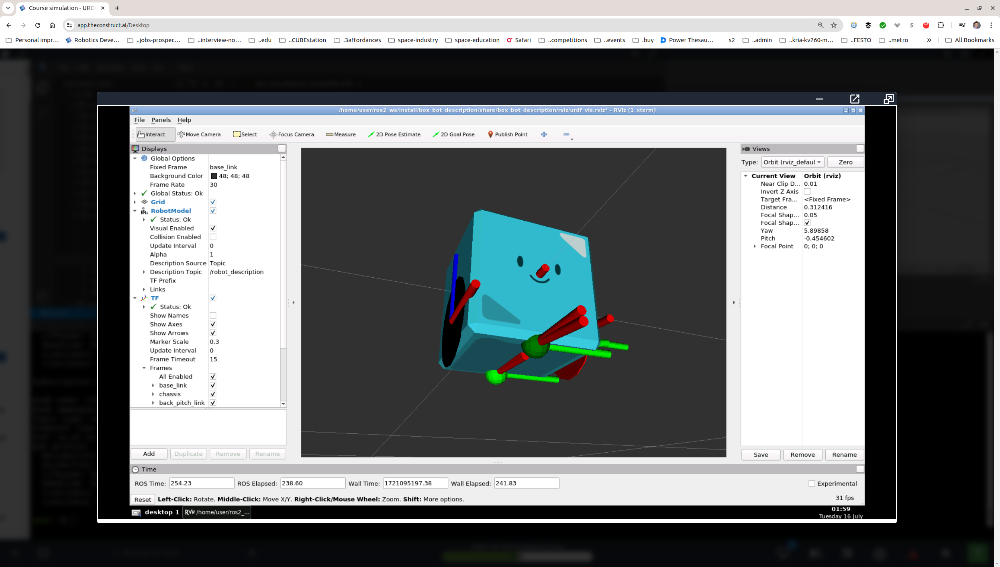
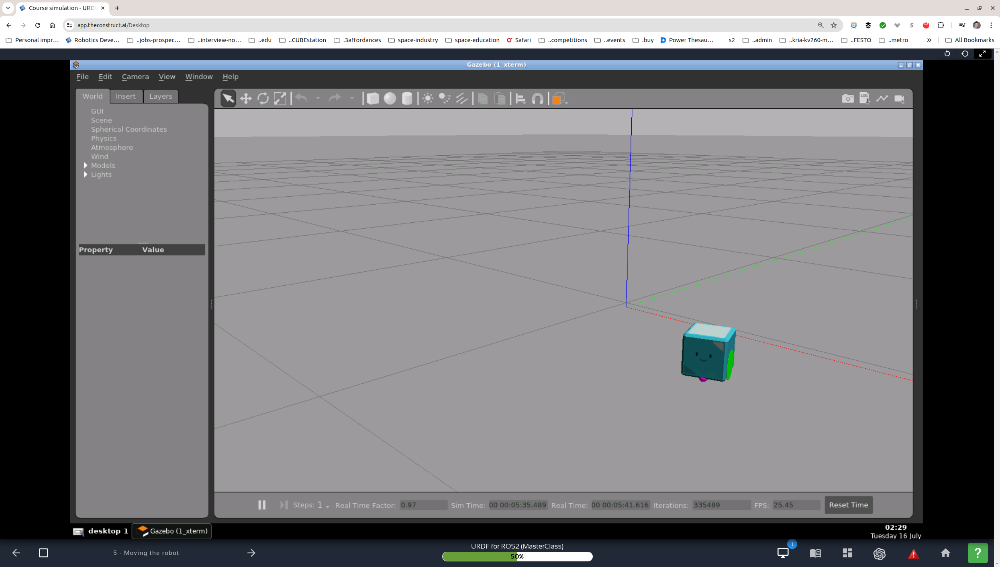
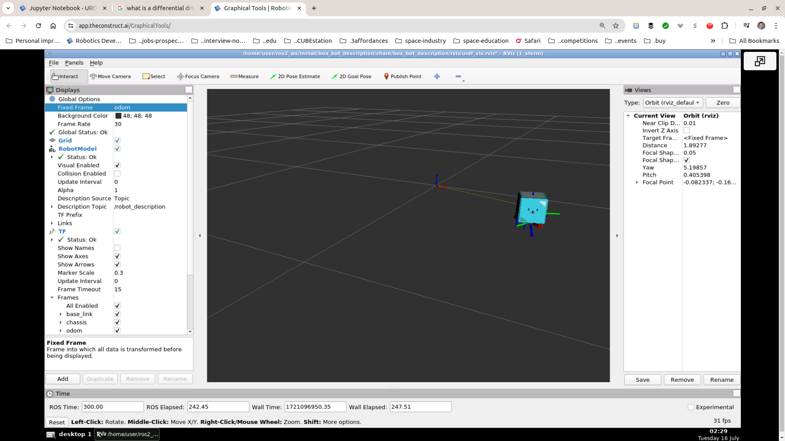
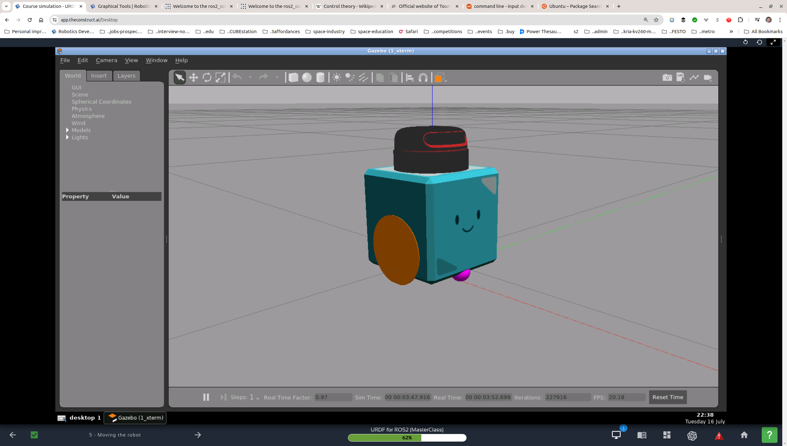
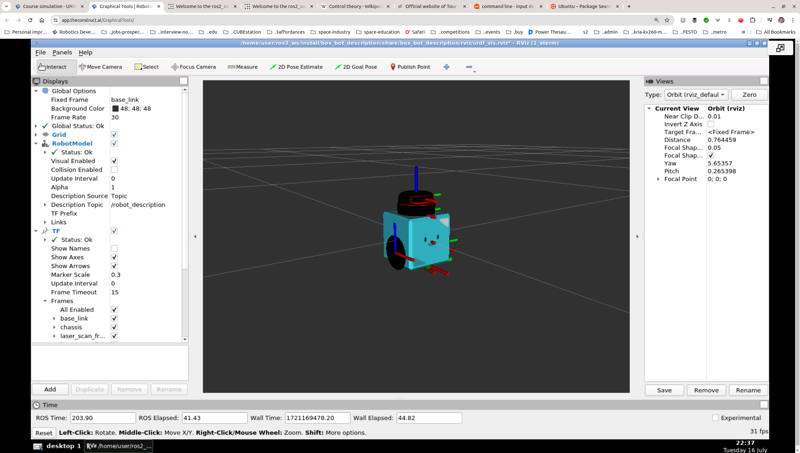

### `box_bot_gazebo`

#### `box_bot_description`

The repository [`box_bot_description`](https://github.com/ivogeorg/box_bot_description) contains the robot model to populate in Gazebo. 

#### Moments of inertia

##### Formulae for basic solids
```
# "box_inertia"
# params="mass x y z"
# mass: Mass in Kilograms of the link
# x,y,z: Are the size of each side of the box in each of the axes in meters

<inertia  ixx="${mass*(y*y+z*z)/12}" ixy = "0" ixz = "0"
        iyy="${mass*(x*x+z*z)/12}" iyz = "0"
        izz="${mass*(x*x+z*z)/12}"
/>

# "cylinder_inertia" 
# params="mass r l"
# mass: Mass in Kilograms of the link
# r: Radius of the cylinder in meters
# l: Height of the cylinder in meters
# Note: l is parallel to z axis

  <inertia  ixx="${mass*(3*r*r+l*l)/12}" ixy = "0" ixz = "0"
            iyy="${mass*(3*r*r+l*l)/12}" iyz = "0"
            izz="${mass*(r*r)/2}" />

# sphere_inertia"
# params="mass r"
# mass: Mass in Kilograms of the link
# r: Radius of the sphere in meters
<inertia  
      ixx="${2*mass*r*r/5}" ixy = "0" ixz = "0"
      iyy="${2*mass*r*r/5}" iyz = "0"
      izz="${2*mass*r*r/5}"
/>
```
##### Calculator

`source /home/simulations/ros2_sims_ws/install/setup.bash`
`ros2 run spawn_robot_tools_pkg inertia_wizzard`

#### Basic physical properties

| Symbol | Definition | Explanation
| --- | --- | --- |
| **mu1** | The static friction coefficient. | It is how much friction there is until the object starts moving in simple terms.|
| **mu2** | The dynamic friction coefficient. | It is how much friction there is when the object moves in simple terms. |

These values are calculated through friction tests with elements with the same mass as the links you set these values to. Of course, you should also remember the materials they are made of and so on. However, in reality, it sets them with the values that make the robot behave correctly, not necessarily the real ones.

| Symbol | Definition | Explanation
| --- | --- | --- |
| **kp** | This coefficient sets the static contact stiffness. | This determines whether the linked material is closer to marble (rigid, bigger values) or more like rubber (soft material, lower values). |
| **kd** | This coefficient sets the dynamic contact stiffness. | This determines whether the linked material is closer to marble (rigid, bigger values) or more like rubber (soft material, lower values). It is essentially how much it deforms over a long period, exerting its pressure. |

##### Only for elements that touch the ground

```
  <gazebo reference="left_wheel">
    <kp>1000000000000000000000000000.0</kp>
    <kd>1000000000000000000000000000.0</kd>
    <mu1>10.0</mu1>
    <mu2>10.0</mu2>
    <material>Gazebo/Red</material>
  </gazebo>

  <gazebo reference="right_wheel">
    <kp>1000000000000000000000000000.0</kp>
    <kd>1000000000000000000000000000.0</kd>
    <mu1>10.0</mu1>
    <mu2>10.0</mu2>
    <material>Gazebo/Green</material>
  </gazebo>

  <gazebo reference="front_pitch_link">
    <kp>1000000000000000000000000000.0</kp>
    <kd>1000000000000000000000000000.0</kd>
    <mu1>0.5</mu1>
    <mu2>0.5</mu2>
    <material>Gazebo/Purple</material>
  </gazebo>

  <gazebo reference="back_pitch_link">
    <kp>1000000000000000000000000000.0</kp>
    <kd>1000000000000000000000000000.0</kd>
    <mu1>0.5</mu1>
    <mu2>0.5</mu2>
    <material>Gazebo/Yellow</material>
  </gazebo>
```

#### Launching Gazebo world and spawning Box Bot

1. In terminal, launch the empty world in Gazebo:
   1. `cd ~/ros2_ws`
   2. `colcon build`
   3. `source install/setup.bash`
   4. `ros2 launch box_bot_gazebo start_world.launch.py
2. In another terminal, spawn the robot and publish it's static transforms (Rviz also started but without the [`joint_state_publisher_gui`](https://github.com/ivogeorg/box_bot_description/blob/main/README.md#starting-rviz2-and-joint_state_publisher_gui), all links but the `base_link` and `chassis` are missing):
   1. `cd ~/ros2_ws`
   2. _(optional)_ `colcon build`
   3. `source install/setup.bash`
   4. `ros2 launch box_bot_gazebo spawn_robot_ros2_physical.launch.xml`  

  

#### Publishing joint states

##### Launching a joint state publisher node

For example, see previous heading.

##### Adding a Gazebo ROS joint state publisher plugin

```
<gazebo>
    <plugin name="box_bot_joint_state" filename="libgazebo_ros_joint_state_publisher.so">
    <ros>
        <remapping>~/out:=joint_states</remapping>
    </ros>
    <update_rate>30</update_rate>
    <joint_name>joint_left_wheel</joint_name>
    <joint_name>joint_right_wheel</joint_name>

    <joint_name>front_yaw_joint</joint_name>
    <joint_name>back_yaw_joint</joint_name>
    <joint_name>front_roll_joint</joint_name>
    <joint_name>back_roll_joint</joint_name>
    <joint_name>front_pitch_joint</joint_name>
    <joint_name>back_pitch_joint</joint_name>

    </plugin>
</gazebo>
```

##### Topic `/joint_states`

Now Rviz2 shows all the links of the robot:  
  

#### Moving the robot

1. Add joint state publisher and differential drive plugins.
2. Launch Gazebo and spawn the robot with /robot_description and /joint_states topics.
   1. Start Gazebo with empty world  
      `cd ~/ros2_ws`  
      `colcon build`  
      `source install/setup.bash`  
      `ros2 launch box_bot_gazebo start_world.launch.py`  
   2. Spawn the robot and publish to topics  
      `cd ~/ros2_ws`  
      `source install/setup.bash`  
      `ros2 launch box_bot_gazebo spawn_robot_ros2_control.launch.xml`       
3. Teleoperate with keyboard.
   `ros2 run teleop_twist_keyboard teleop_twist_keyboard`

  
  

#### ROS2 Control in Gazebo

[`ros2_control`](https://control.ros.org/rolling/index.html) is a powerful package for robot control in ROS 2.

A small example of using it is shown with a scanner which can be moving "in and out of" the robot body.  

  
=======
```
[gzserver-1] [INFO] [1721169436.257384484] [box_bot_joint_state]: Going to publish joint [joint_left_wheel][gzserver-1] [INFO] [1721169436.257680481] [box_bot_joint_state]: Going to publish joint [joint_right_wheel][gzserver-1] [INFO] [1721169436.257697876] [box_bot_joint_state]: Going to publish joint [front_yaw_joint][gzserver-1] [INFO] [1721169436.257707970] [box_bot_joint_state]: Going to publish joint [back_yaw_joint][gzserver-1] [INFO] [1721169436.257717722] [box_bot_joint_state]: Going to publish joint [front_roll_joint][gzserver-1] [INFO] [1721169436.257726570] [box_bot_joint_state]: Going to publish joint [back_roll_joint][gzserver-1] [INFO] [1721169436.257735738] [box_bot_joint_state]: Going to publish joint [front_pitch_joint]
[gzserver-1] [INFO] [1721169436.257744701] [box_bot_joint_state]: Going to publish joint [back_pitch_joint]
[gzserver-1] [INFO] [1721169436.527692203] [differential_drive_controller]: Wheel pair 1 separation set to [0.100000m]
[gzserver-1] [INFO] [1721169436.527778761] [differential_drive_controller]: Wheel pair 1 diameter set to [0.070000m]
[gzserver-1] [INFO] [1721169436.528729083] [differential_drive_controller]: Subscribed to [/cmd_vel]
[gzserver-1] [INFO] [1721169436.536845398] [differential_drive_controller]: Advertise odometry on [/odom]
[gzserver-1] [INFO] [1721169436.539397520] [differential_drive_controller]: Publishing odom transforms between [odom] and [base_link]
[gzserver-1] [INFO] [1721169437.462947666] [gazebo_ros2_control]: Loading gazebo_ros2_control plugin
[gzserver-1] [INFO] [1721169437.475064302] [gazebo_ros2_control]: Starting gazebo_ros2_control plugin in namespace: /
[gzserver-1] [INFO] [1721169437.475771653] [gazebo_ros2_control]: Starting gazebo_ros2_control plugin in ros 2 node: gazebo_ros2_control
[gzserver-1] [INFO] [1721169437.475824488] [gazebo_ros2_control]: Loading parameter file /home/user/ros2_ws/install/box_bot_description/share/box_bot_description/config/controller_position.yaml
[gzserver-1]
[gzserver-1] [INFO] [1721169437.479767286] [gazebo_ros2_control]: connected to service!! /robot_state_publisher_node
[gzserver-1] [INFO] [1721169437.481644954] [gazebo_ros2_control]: Recieved urdf from param server, parsing...
[gzserver-1] [INFO] [1721169437.883198988] [gazebo_ros2_control]: Loading joint: laser_scan_link_joint
[gzserver-1] [INFO] [1721169437.883276391] [gazebo_ros2_control]:       Command:
[gzserver-1] [INFO] [1721169437.883293695] [gazebo_ros2_control]:                position
[gzserver-1] [INFO] [1721169437.883341815] [gazebo_ros2_control]:       State:
[gzserver-1] [INFO] [1721169437.883354175] [gazebo_ros2_control]:                position
[gzserver-1] [INFO] [1721169437.883384107] [gazebo_ros2_control]:                velocity
[gzserver-1] [INFO] [1721169437.883395216] [gazebo_ros2_control]:                effort
[gzserver-1] [INFO] [1721169437.883826436] [gazebo_ros2_control]: Loading controller_manager
[gzserver-1] [WARN] [1721169438.186337858] [gazebo_ros2_control]:  Desired controller update period (0.01 s) is slower than the gazebo simulation period (0.001 s).
[gzserver-1] [INFO] [1721169438.186613481] [gazebo_ros2_control]: Loaded gazebo_ros2_control.
[gzserver-1] [INFO] [1721169438.378729946] [controller_manager]: Loading controller 'joint_trajectory_controller'
[gzserver-1] [INFO] [1721169438.761729529] [controller_manager]: Loading controller 'joint_state_broadcaster'
[gzserver-1] [INFO] [1721169439.083340941] [controller_manager]: Configuring controller 'joint_trajectory_controller'
[gzserver-1] [INFO] [1721169439.083695418] [joint_trajectory_controller]: Command interfaces are [position] and and state interfaces are [position velocity].
[gzserver-1] [INFO] [1721169439.085478078] [joint_trajectory_controller]: Controller state will be published at 50.00 Hz.
[gzserver-1] [INFO] [1721169439.092730240] [joint_trajectory_controller]: Action status changes will be monitored at 20.00 Hz.
[gzserver-1] [INFO] [1721169439.206844094] [controller_manager]: Configuring controller 'joint_state_broadcaster'
[gzserver-1] [INFO] [1721169439.206992053] [joint_state_broadcaster]: 'joints' or 'interfaces' parameter is empty. All available state interfaces will be published
```

  
```
[spawner-5] [INFO] [1721169438.763467635] [spawner_joint_trajectory_controller]: Loaded joint_trajectory_controller
[spawner-4] [INFO] [1721169439.084102899] [spawner_joint_state_broadcaster]: Loaded joint_state_broadcaster
[spawner-4] [INFO] [1721169439.228652070] [spawner_joint_state_broadcaster]: Configured and started joint_state_broadcaster
[spawner-5] [INFO] [1721169439.247423035] [spawner_joint_trajectory_controller]: Configured and started joint_trajectory_controller
```

